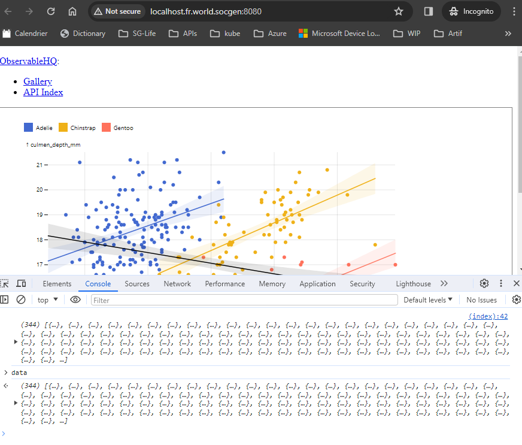
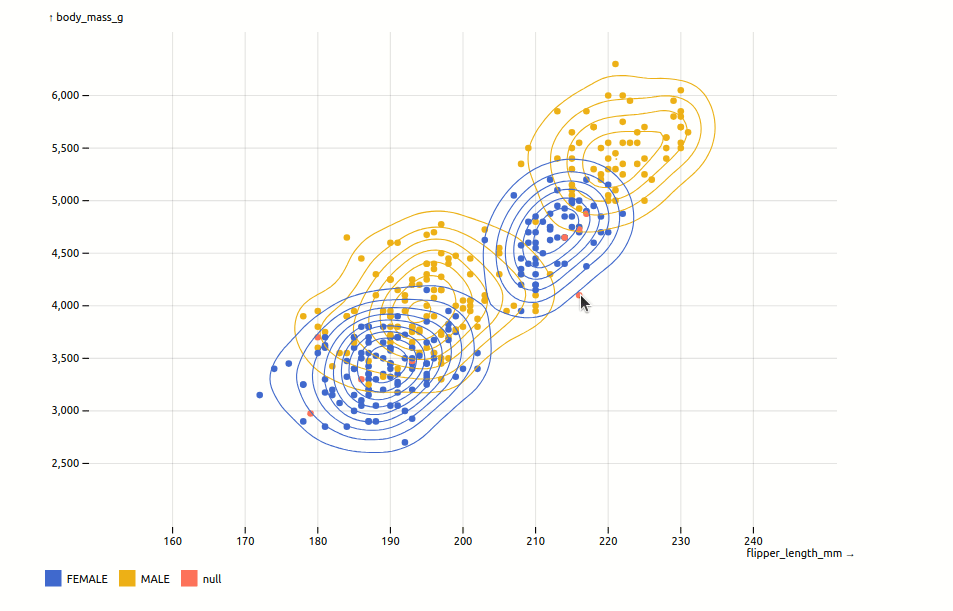

# Prototype Plot in browser

Ref: <https://observablehq.com/plot/>

## Commands

```sh
# from folder containing index.html

python -m http.server 8080
```

Open browser console (F12):



## Links

Misc info:

+ zoom:
  + <https://observablehq.com/d/afe64fd13a4194eb>
  + <https://github.com/observablehq/plot/issues/1590>
+ legend:
  + <https://talk.observablehq.com/t/legend-placement-options/8407/2>

## Issues

Misaligned zoom issue in page but ok in equivalent [notebook](https://observablehq.com/d/98fa0c34fb79cfae).


